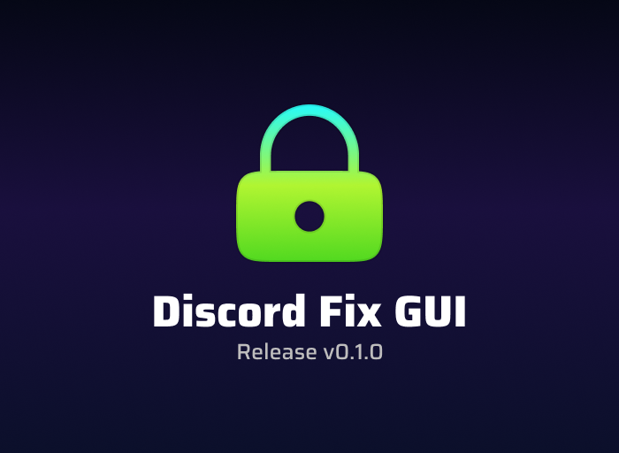

# Discord Fix GUI

Простой и удобный графический интерфейс для набора скриптов **Discord Fix** — утилиты для обхода блокировок провайдеров и восстановления доступа к Discord и другим популярным сервисам (YouTube, Instagram, Telegram) в регионах, где они заблокированы.

> **Внимание:** это только графическая оболочка для давно известной программы **Discord Fix**.  
> Скачать оригинальный Discord Fix и узнать подробности можно [здесь](https://howdyho.net/windows-software/discord-fix-snova-rabotayushij-diskord-vojs-zvonki).

> **Скачать _Discord Fix GUI_ для Windows**: [Release v0.1.0](https://github.com/fuderis/discord-fix-gui/raw/main/DiscordFixGUI.zip)

## Возможности:

* **Простой интерфейс:** Запуск Discord Fix и вспомогательных скриптов в несколько кликов.
* **Выбор сервиса:** Быстрое исправление Discord, YouTube или обоих сервисов сразу.
* **Автоматическая настройка:** Поддержка популярных российских провайдеров (МГТС, ТТК, Билайн, Ростелеком и др.).
* **Без VPN:** Перенаправляется только необходимый трафик, что обеспечивает высокую скорость и приватность.

## Как это работает?

* Интерфейс запускает выбранные скрипты Discord Fix в фоне.
* Изменяются настройки соединения и маршрутизации для обхода блокировок, возвращая полный доступ к Discord и другим сервисам.
* GUI не шифрует весь трафик, как VPN, а только устраняет блокировки для выбранных сервисов.

## Установка:

* Скачайте [последнюю версию](https://github.com/fuderis/discord-fix-gui/raw/main/DiscordFixGUI.zip).
* Распакуйте архив и установите приложение.
* **ВАЖНО!**: Кликните правой кнопкой мыши по ярлыку программы на рабочем столе → **Свойства** → **Совместимость** → включите опцию **"Запускать от имени администратора"**.  
  *(Без этого программа работать не будет.)*
* **Чтобы добавить программу в автозагрузку:** нажмите **Win + R**, введите `shell:startup` и перенесите ярлык программы в открывшуюся папку.

## Использование:

* Перед запуском отключите VPN и прокси для корректной работы Discord Fix GUI.
* Выберите своего провайдера из выпадающего списка.
* Нажмите центральную кнопку для применения конфигурации и запуска фиксов.
* Откройте YouTube, Discord или нужный сервис — теперь всё должно работать без ограничений.

## Решение проблем:

* **Если фикс не работает:** Запустите программу от имени администратора.
* **Если не помогло:** Возможно, *Windows Defender* или другой антивирус блокирует приложение. Попробуйте временно отключить антивирус или добавить Discord Fix GUI в список исключений.

## Обратная связь:

Связаться со мной можно [здесь](https://t.me/fuderis), а также загляните на мой [канал](https://t.me/fuderis_club).  
Буду рад вашим предложениям и отзывам!

> Copyright (c) 2025 *Bulat Sh.* ([fuderis](https://t.me/fuderis))
